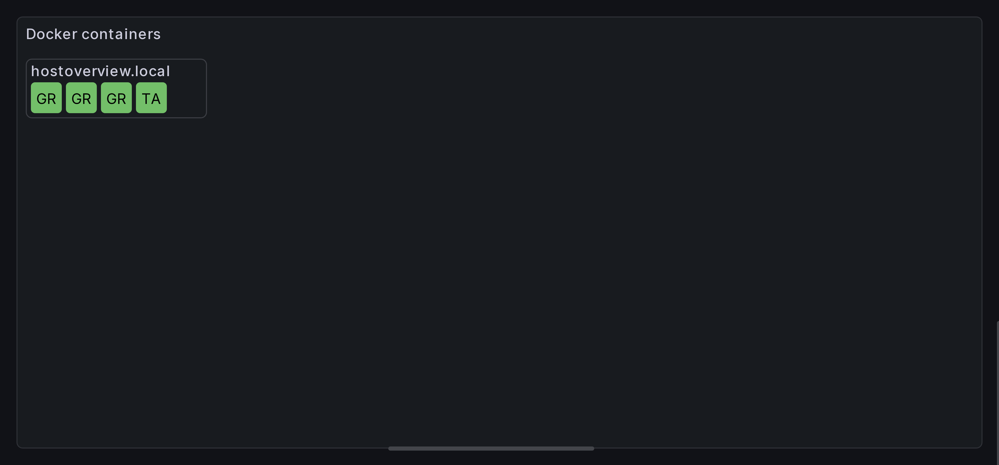
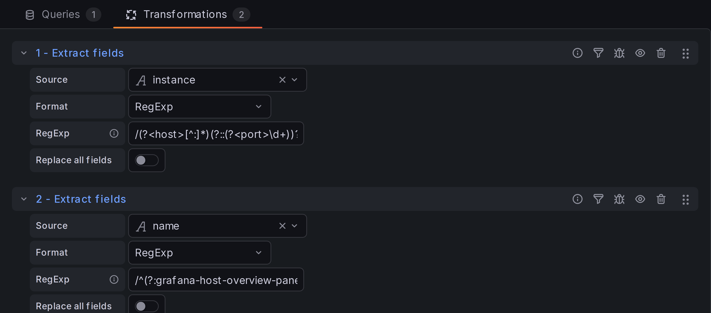
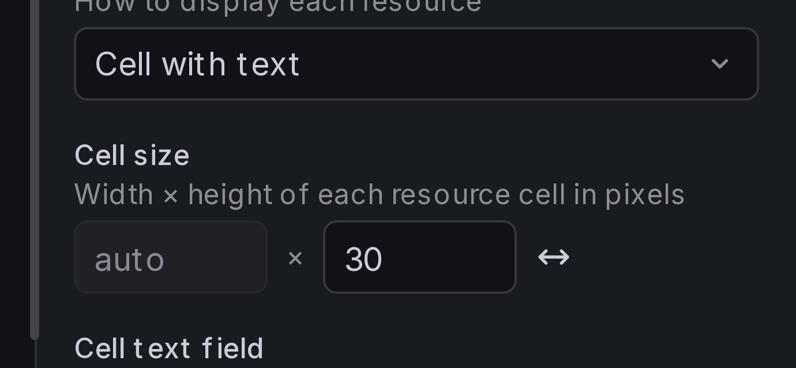
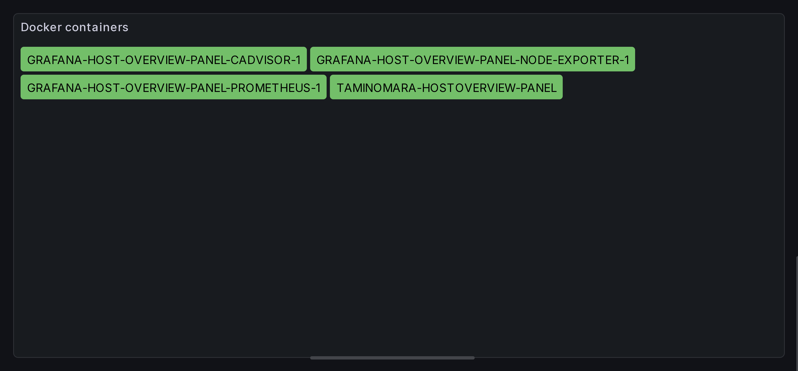

# Working with long resource names

When the field driving cell text is long — container names with a common
prefix, fully-qualified hostnames, build job IDs — cell text gets cut off
in "Cell with text" display mode:

You have two complementary approaches:

1.  **Shorten the text** with a transformation — keeps cells compact and
    drops the noise so the part that distinguishes each cell is what's
    visible.
2.  **Resize the cell** to fit — shows the full text without changing it.

The two compose. Stripping a common prefix often gets you most of the
way; auto-fit handles whatever variance remains.

## Approach 1: Strip a common prefix with a transformation

Often the noise in a resource name is a shared prefix. Grafana's built-in
**Extract fields** transformation can pull the meaningful portion into a
new field, which you then use as the cell text.

Switch to the **Transform data** tab and add **Extract fields**:

-   **Source** — the field with the long name (e.g. `name`).
-   **Format** — `RegExp`.
-   **Regular expression** — `/(?:prefix-|other-prefix-)?(?<cellTitle>.*)/`

Replace `prefix-` and `other-prefix-` with the actual prefixes in your
data. The optional non-capturing group `(?:...)?` matches the prefix when
it's present and silently skips it when it isn't, so the same regex works
for every row. The greedy named capture `(?<cellTitle>.*)` then takes
whatever remains.

Back in the panel options, set **Resource content** > **Cell text field**
to the new `cellTitle` field. Each cell now starts with the part of the
name that distinguishes it, instead of the shared prefix:

The cells in this example are still small enough to truncate the labels,
but you can now tell them apart at a glance — and full text is always
visible in the tooltip. If you need the full label on the cell as well,
combine this with the auto-fit approach below.

!!! tip

    The transformation produces a regular field, so the cleaned-up value
    is also available for sorting, tooltips, joins, and any other place
    that takes a field name.

## Approach 2: Resize cells to fit text

If you'd rather see the full label, change the cell size. The
**Resource content** > **Cell size** control accepts width and height
independently, with three modes selected by the icon button next to the
inputs:

-   **Free** (unlock icon) — width and height edited independently.
-   **Locked** (lock icon) — height drives both dimensions; the cell
    stays square.
-   **Auto-fit** (arrows icon, "Cell with text" only) — width grows to
    fit the cell's text. Width never shrinks below the cell height, so
    short labels still look like cells, not slivers.

In auto-fit mode the cell width shows as `auto` and only the height is
editable.

!!! tip

    Auto-fit works best with the **Flow** layout (the default). Other
    layouts assume a fixed cell size per row, so they'll honor the
    minimum width but won't gain you anything from the variable widths.

!!! tip

    Cell text is rendered upper-case by default, which makes the letters
    noticeably wider. If you're trying to squeeze more characters into a
    fixed cell, turn off **Resource content** > **Capitalize cell text**.
    Lowercase glyphs are narrower on average — most visibly the `i`,
    `l`, and `t` — so the same text takes up less room.
