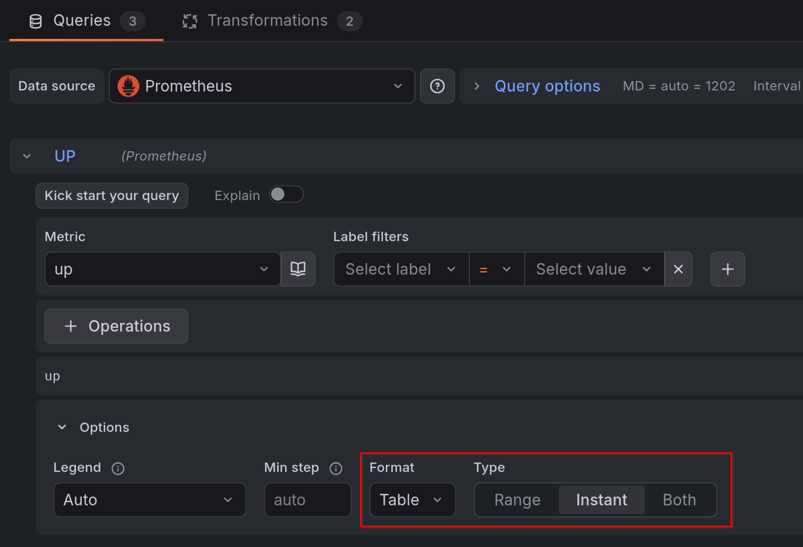

# Data format

Host Overview Panel expects data in **long format**: a table where each row represents
one resource, with columns for its identity, status, grouping keys, and any additional
metrics.

## Required columns

At minimum, the panel needs:

- A **status field** — used to color each resource cell (e.g. `up`, `status`, `state`).

The following columns are optional but commonly used:

- An **ID field** — uniquely identifies each resource. Used for sorting, detecting
  missing data (known IDs), and labeling cells.
- One or more **grouping fields** — used to nest resources into hierarchical groups
  (e.g. `host`, `datacenter`, `rack`).

Any other columns in the data frame can be displayed as metrics in tooltips, rich table
cards, or group headers.

## Query settings

Two query settings affect the shape of the data the panel receives: **type** and
**format**.

### Instant queries with Table format (simplest)

Set the query type to **Instant** and format to **Table**. This produces a flat
table with one row per series and labels as columns — exactly the long format the
panel expects, with no transformations needed.

Use this combination when you only need the current resource status and plan to
display values as text, colored cells, or gauges.

### Range queries with Time series format (for sparklines)

Set the query type to **Range** and keep the default **Time series** format. This
returns full time series over the dashboard time range, which you can turn into
sparklines.

Range queries require transformations to convert the data into the table format
the panel expects. The **[Time series to table]** transformation
produces a `Trend` column containing the embedded time series suitable for
sparkline rendering.

[Time series to table]: https://grafana.com/docs/grafana/latest/visualizations/panels-visualizations/query-transform-data/transform-data/#time-series-to-table-transform

!!! note

    Range queries with **Table** format produce one row per timestamp, not one row
    per series. This is not useful for the Host Overview Panel. Use Time series
    format with transformations instead.

## Multiple data frames

When your panel has multiple queries, each query produces a separate data frame. The
panel visualizes one **primary data frame** — selected via the **Data frame** option
at the top of the panel settings. When left empty, the first frame is used.

Additional data frames are not displayed directly. Instead, they can be attached to
groups or resources through [joins](tutorial/joins.md), allowing you to pull in metrics,
status values, or known IDs from secondary queries.
