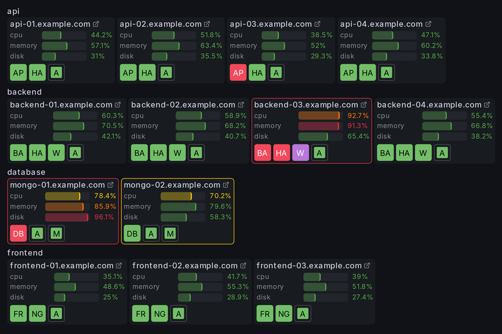
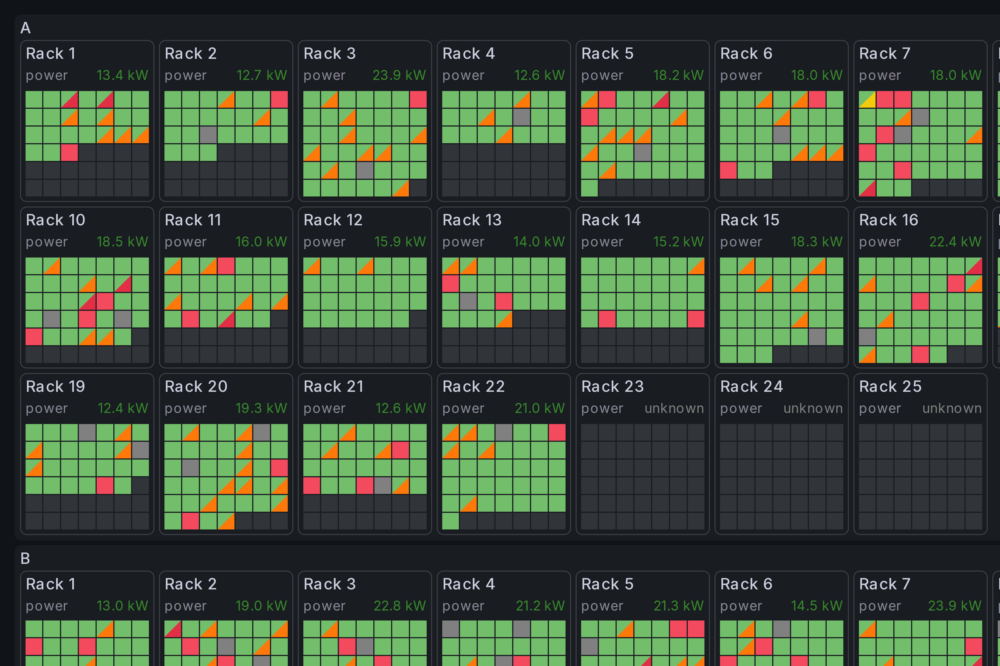
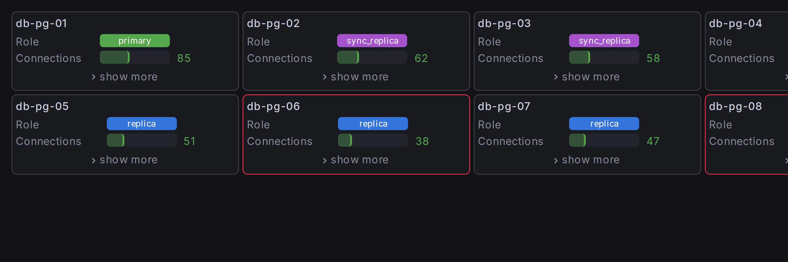

# Host Overview Panel

A Grafana panel plugin for visualizing the status of fleets of resources — servers, database instances, containers, or any entity with a status field and optional metrics.

## Features

- **Modern design for Grafana 12** — the panel uses built-in theme-ready components.
- **Flexible grouping** — nest resources by any combination of fields, with configurable sort order, coloring, and layout.
- **Multiple display modes** — simple colored cells, cells with text labels, or rich table cards showing multiple fields per resource.
- **Joins** — attach metrics from other data frames to groups or individual resources via key-based joins.
- **Field visualizations** — text, colored text, colored background, gauges, and sparklines for joined or inline fields.
- **Color overrides** — fields and joins can override cell or group border colors based on threshold severity.
- **Data links support** — define data links for any group, resource, or metric.
- **Tooltips** — hoverable tooltips with configurable title, fields, and joined data.

## Requirements

- Grafana 12.0 or later.

## Links

- [Source code](https://github.com/taminomara/grafana-host-overview-panel/)
- [Issue tracker](https://github.com/taminomara/grafana-host-overview-panel/issues)
- [Changelog](https://github.com/taminomara/grafana-host-overview-panel/blob/main/CHANGELOG.md)
