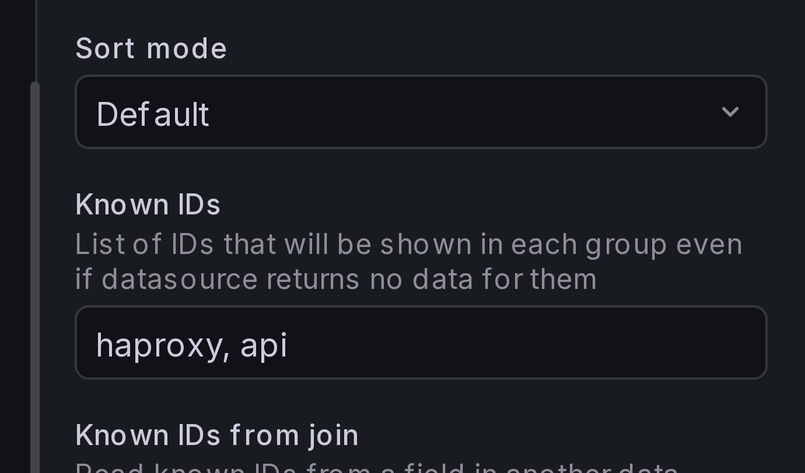
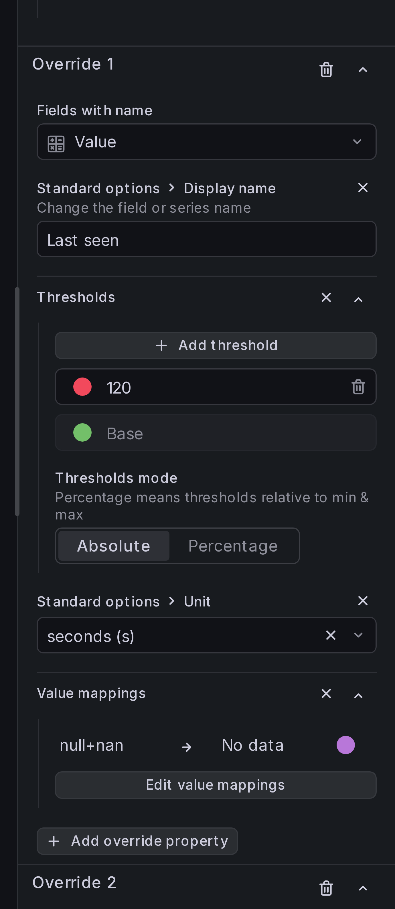
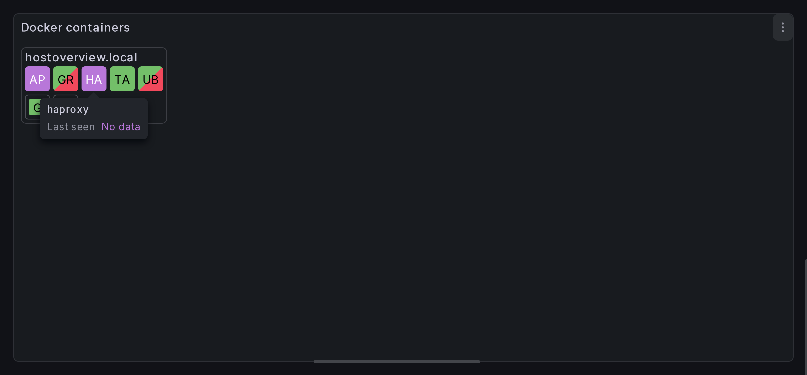

# Adding known IDs

When a host or container dies, monitoring can stop sending its data to Grafana,
leading to resources quietly disappearing from panels. To prevent this,
the Host Overview panel allows adding known resource IDs: resources with these IDs
will be displayed even if there is no data for them.

## Step 1: Add known IDs

Under **Resource** > **Known IDs**, add a comma-separated list of container names
that should always be present on the panel. For example, we'll add `haproxy`
and `api` containers:

{ width="300" }

## Step 2: Adjust value mappings to highlight missing resources

When data for a known resource is missing, all its field values are null. By
default, the panel uses the base threshold color for this resource's cell and
displays "unknown" as the field value. To make missing resources stand out, add
a value mapping for the status field.

Add a **field override** for the `Value` field (our status field). Under
**Value mappings**, add a **Special** mapping for `Null + NaN` that maps to
"No data" with a distinct color (e.g. purple):

{ width="300" }

## Result

You should now see cells for `haproxy` and `api` in every host group, even when
no data is returned for them. Missing containers are colored purple and labeled
"No data".

## Other ways to provide known IDs

### Group-level known IDs

Each group has its own **Known IDs** field in its settings. Unlike panel-level
known IDs (which add resources), group-level known IDs add **groups** with the
listed values — ensuring that a group box appears even when the data source
returns no rows with that group key value.

### Known IDs from join

Instead of listing IDs manually, you can read them from a field in another data
frame. Configure a **Known IDs from join** with:

- **Foreign Frame** — the data frame containing the list of expected IDs.
- **Foreign Field** — the field with the ID values.
- **Keys** — key pairs to filter the foreign frame by group values.

This is available at both the panel level (under **Resource**) and per-group
level (in group settings).
