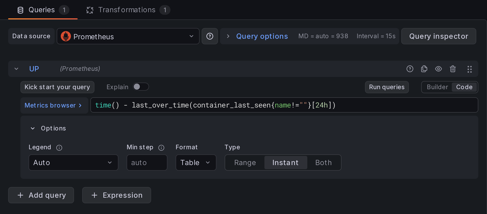
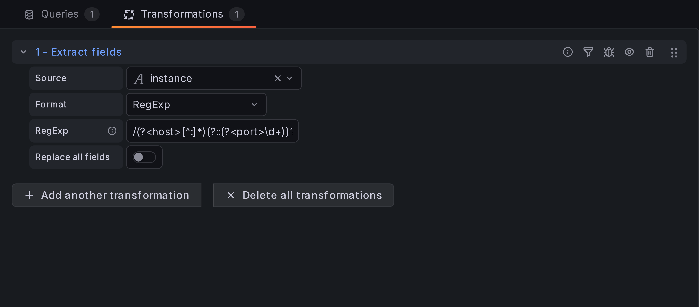
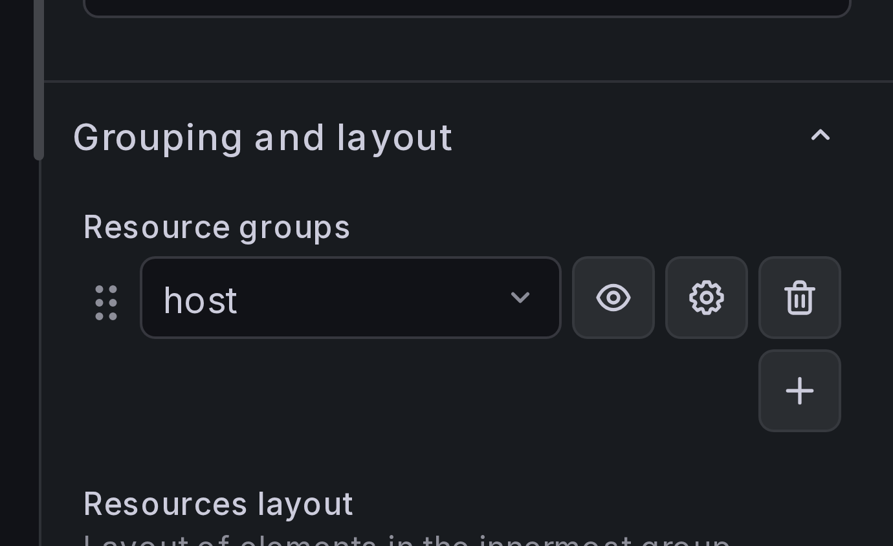
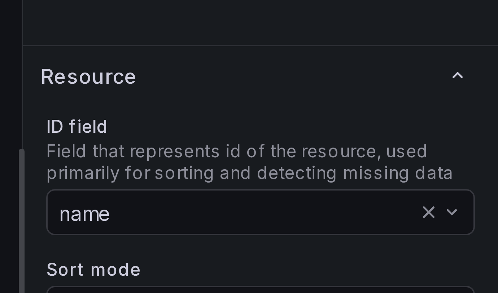
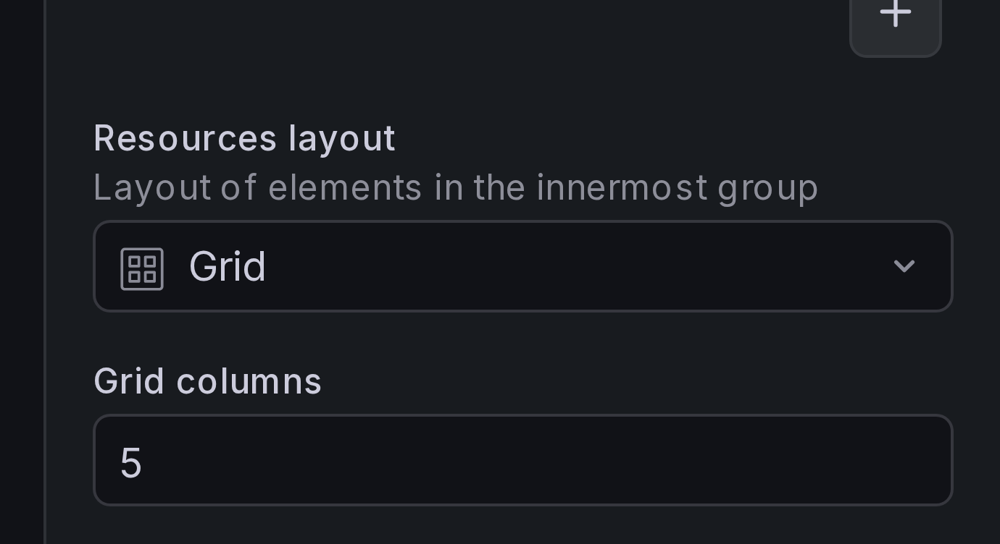
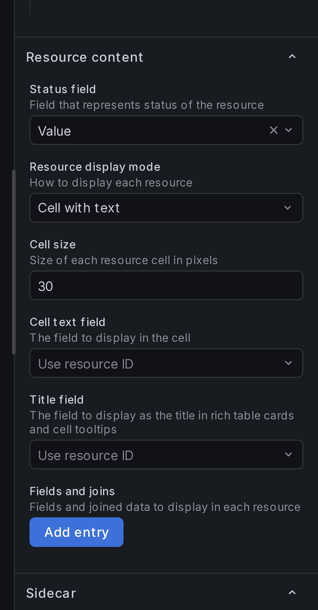
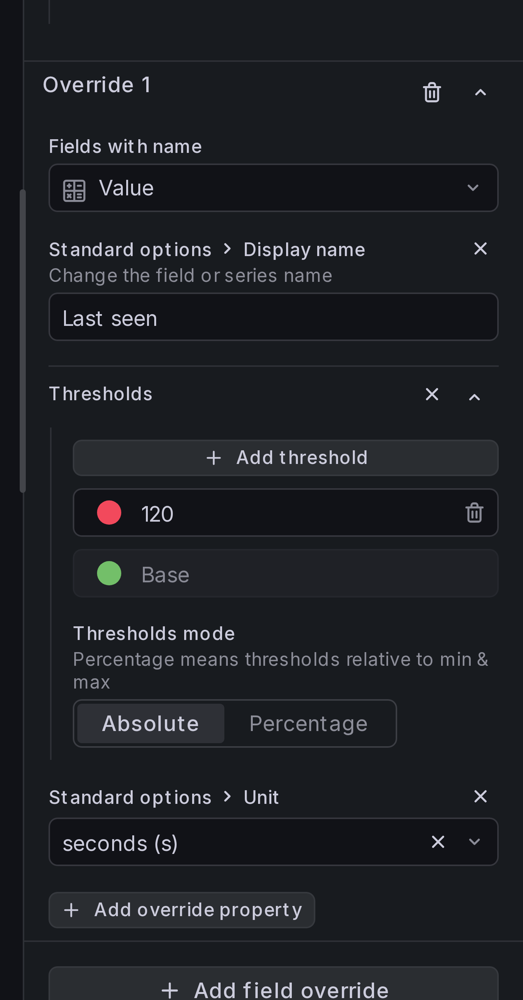
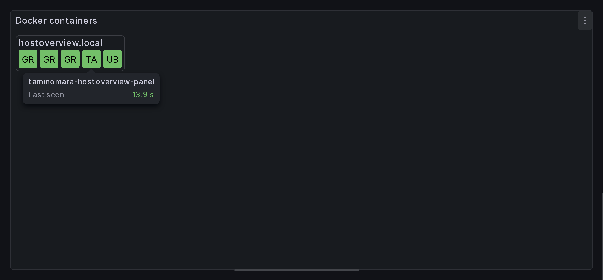

# Basic setup

In this section we'll create a Host Overview panel that shows the status of all
docker containers, grouped by host.

## Step 1: Create the panel

Create a new panel and select **Host Overview** as the visualization type.

## Step 2: Add a query

Select your Prometheus data source and add a query for the `container_last_seen`
metric:

```
time() - last_over_time(container_last_seen{name!=""}[24h])
```

Set the query type to **Instant** and the format to **Table**.



## Step 3: Add data transformations

By default, Prometheus exports label `instance` that contains host and port.
We need to split it: add **Extract fields** transformation,
set the source to `instance`, format to **RegExp**, and use the pattern:

```
/(?<host>[^:]*)(?::(?<port>\d+))?/
```



## Step 4: Add grouping

In the panel settings sidebar, find **Grouping and layout**
and click **Add new grouping rule**. Select group key `host`.

This nests resources under their host, so each host gets its own labeled box.

{ width="300" }

## Step 5: Set up layout

Under **Grouping and layout** > **Resources layout**, select `Grid`.

{ width="300" }

## Step 6: Set the resource ID field

Under **Resource** > **ID field**, select `name`. The ID field uniquely identifies each
resource within a group and is used for sorting and detecting missing data.

{ width="300" }

## Step 7: Configure resource content

Under **Resource content**:

-   Set **Status field** to `Value`.
-   Set **Resource display mode** to "Cell with text".
-   Set **Cell size** to `30`.

{ width="300" }

## Step 8: Add field overrides

Add a **field override** (type: "Fields with name") for the `Value` field:

-   Override **Display name** to give it a friendlier label.
-   Override **Threshold** to set different colors for different "last seen" values.
-   Override **Unit**, set it to "seconds".

{ width="300" }

## Result

You should now see colored cells for each container, grouped by host,
with text labels showing the container name.


