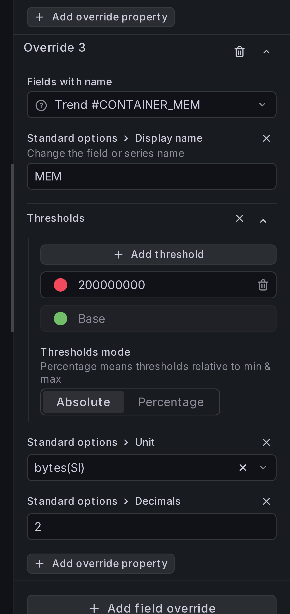
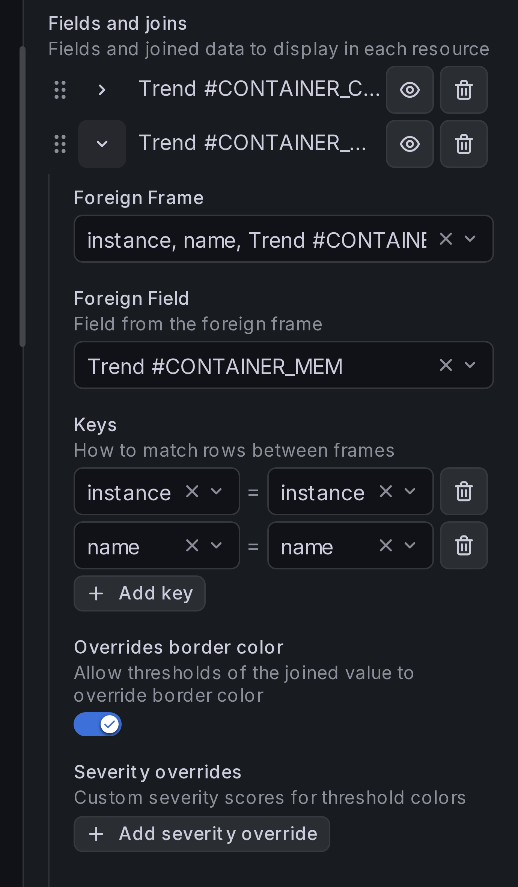
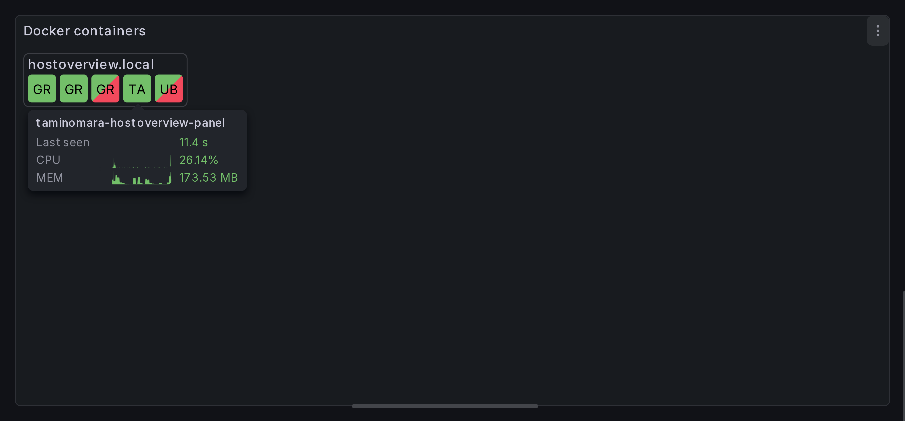

# Displaying thresholds in cells

In the [previous section](joins.md) we've added more data to cell tooltips.
Now we'll set up thresholds so that cells can display if container's CPU
or Memory are over the limits.

## Step 1: Adjust thresholds for CPU and Memory

To test this functionality, let's set up thresholds for Memory
so that field's color is red if container consumes more than 200Mb.

Under field override for `Trend #CONTAINER_MEM`, add thresholds override:

-   Base color is green,
-   For values above 200000000, color is red.

{ width="300" }

## Step 2: Enable "cell/border color overrides"

Under **Resource content** > **Fields and joins**, toggle **Overrides border color**
for each joined field:

{ width="300" }

## Result

Cells for containers that take more than 200Mb of memory should be highlighted
with red gradient.

The top-left part of the cell displays resource status
(in our case, it's `container_last_seen`). The bottom-right part of the cell
displays color of the most severe threshold found in cell's tooltip.

## How panel decides on cell's color

When rendering a cell, HostOverview panel checks thresholds for all fields
displayed in the cell's tooltip. It selects the most "severe" one, and applies
its color.

Threshold's severity is calculated using the following algorithm:

1. The panel finds the **severity-zero anchor** — the threshold step that represents
   "normal." It picks the first step with a green color (`green`, `semi-dark-green`,
   `dark-green`, `light-green`, `super-light-green`). If none is green, the first
   (base) step is used.

2. For the current field value, the panel determines which threshold step is active.

3. The severity score is the **normalized distance** from the anchor step to
   the active step in the threshold list: `|anchor_index - active_index| / max_distance`,
   where `max_distance` is the furthest any step can be from the anchor.
   This produces a value between 0 (at the anchor) and 1 (at the most extreme step).

4. The field with the highest severity score across all entries wins the cell's
   override color.

Only fields and joins with **Overrides border color** enabled participate in this
calculation. Hidden entries are excluded.

!!! note

    Border color overrides only consider **thresholds**. Value mappings do not
    affect the severity score.

## Custom severity overrides

If the automatic distance-based scoring doesn't produce the desired result, you can
assign explicit severity scores to specific threshold colors. Each display entry
with **Overrides border color** enabled has an optional **Severity overrides**
section where you can map a color to a numeric severity value.

When a custom severity is defined for the active threshold's color, that value is
used directly instead of the distance-based calculation. Higher values take priority
when multiple entries compete for the override color.
