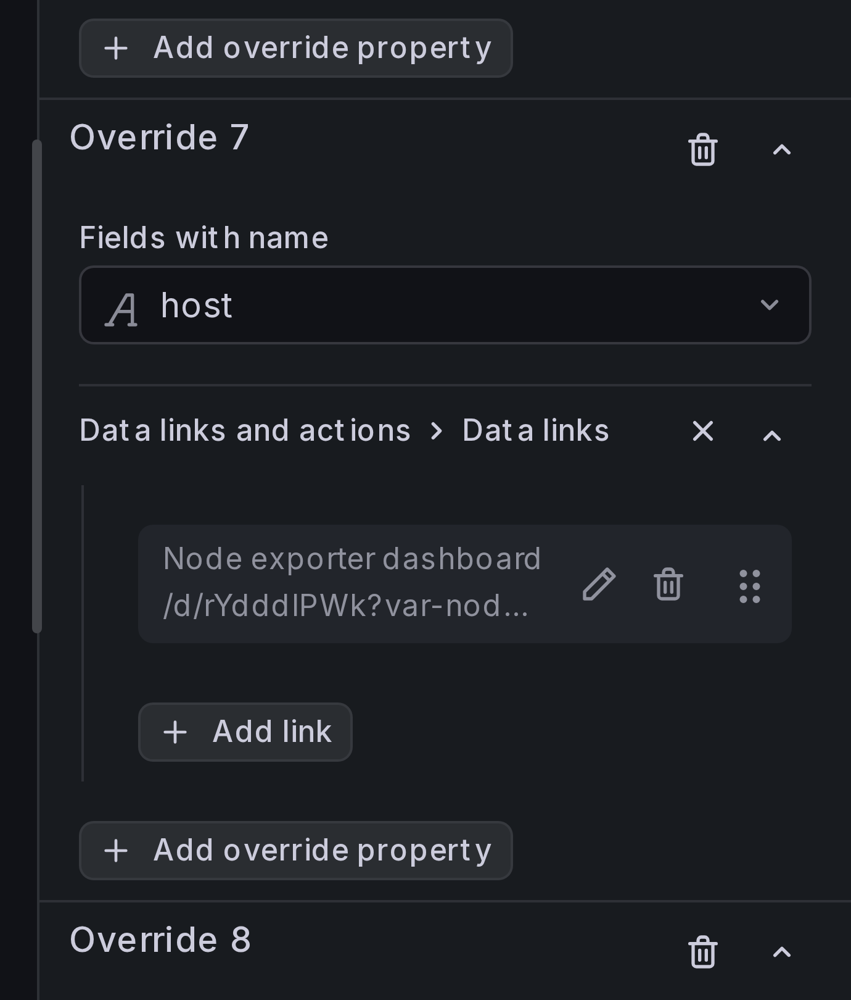
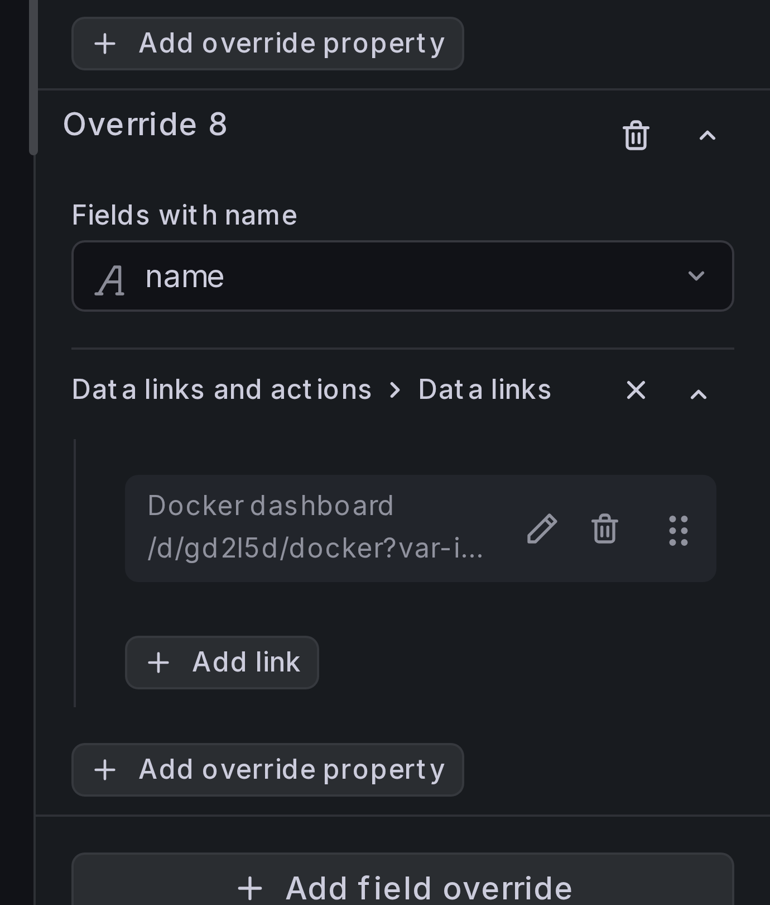
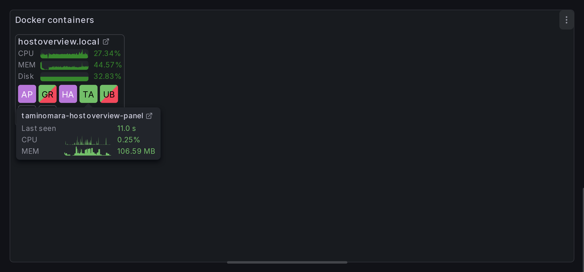

# Adding data links

Data links let you navigate from the overview panel to detailed dashboards.
When configured, a link icon appears next to field names — clicking it opens
the target dashboard with context (host name, container name, time range, etc.)
passed through URL parameters.

## Dashboard URLs and IDs

Data link URLs follow the pattern `/d/<uid>/<slug>?<parameters>`. The `<uid>`
is the unique identifier assigned to a dashboard by Grafana — you can find it
in the dashboard's URL when viewing it in the browser, or in the dashboard JSON
under the `"uid"` field.

The `var-<name>=<value>` query parameters set dashboard variables on the target
dashboard, so it opens filtered to the right host or container.

In the examples below we use UIDs from two community dashboards bundled with
this plugin's dev environment:

- `/d/rYdddlPWk` — a
  [Node Exporter dashboard](https://github.com/taminomara/grafana-host-overview-panel/blob/main/provisioning/dashboards/link_target/node-exporter.json)
  for host-level metrics.
- `/d/gd2l5d` — a
  [Docker dashboard](https://github.com/taminomara/grafana-host-overview-panel/blob/main/provisioning/dashboards/link_target/docker.json)
  for container-level metrics.

!!! note

    Dashboard UIDs are specific to each Grafana instance. If you're linking to
    your own dashboards, replace the UIDs in the examples with the actual UIDs
    from your Grafana setup.

## Step 1: Add a data link to the host field

We'll link each host group to a Node Exporter dashboard so users can drill down
into host-level metrics.

Add a **field override** for the `host` field. Under **Data links**, add a link:

- **Title**: `Node exporter dashboard`
- **URL**:

    ```
    /d/rYdddlPWk?var-nodename=${__data.fields.host}&${__url_time_range}
    ```

- Enable **Open in new tab** if you want the detail dashboard to open in a
  separate browser tab.

{ width="300" }

## Step 2: Add a data link to the container name field

Next, we'll link each container cell to a Docker dashboard.

Add a **field override** for the `name` field. Under **Data links**, add a link:

- **Title**: `Docker dashboard`
- **URL**:

    ```
    /d/gd2l5d?var-instance=${__data.fields.instance}&var-name=${__data.fields.name}&${__url_time_range}
    ```

{ width="300" }

## Result

You should now see link icons in the panel. The host link appears next to each
group title, and the container link appears in the tooltip when you hover over
a cell.



## Where data links appear

Any field can have data links configured via field overrides. The link icon
shows up wherever that field is rendered in the panel:

| Location | Which fields | How it looks |
|----------|-------------|--------------|
| **Group title** | The group key field (e.g. `host`) | Link icon next to the group heading. |
| **Tooltip / card title** | The **ID field** and the **title field** (when set to a real field, not a custom pattern) | Link icons next to the title text. Links from both fields are merged. |
| **Field rows** | Any field or joined field shown as a display entry, including the **status field** | Link icon next to the field label in tooltips, rich table cards, and group headers. |

## Template variables

Use Grafana template variables in link URLs to pass context from the current row:

| Variable | Description |
|----------|-------------|
| `${__data.fields.<name>}` | Value of a field in the current row (e.g. `${__data.fields.host}`). |
| `${__url_time_range}` | Current dashboard time range as URL parameters (`from=...&to=...`). |

See the [Grafana data links documentation](https://grafana.com/docs/grafana/latest/visualizations/panels-visualizations/configure-data-links/)
for the full reference.
