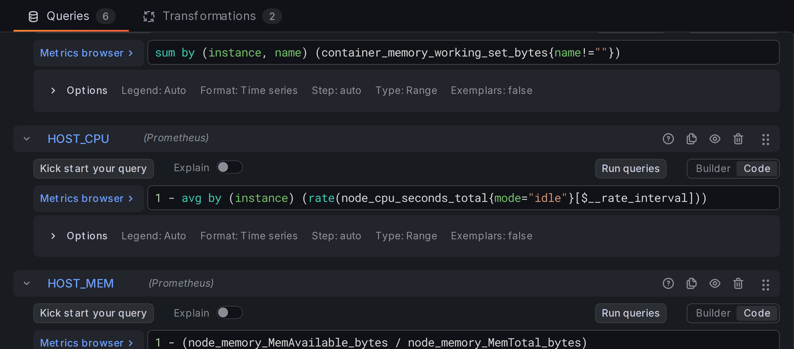
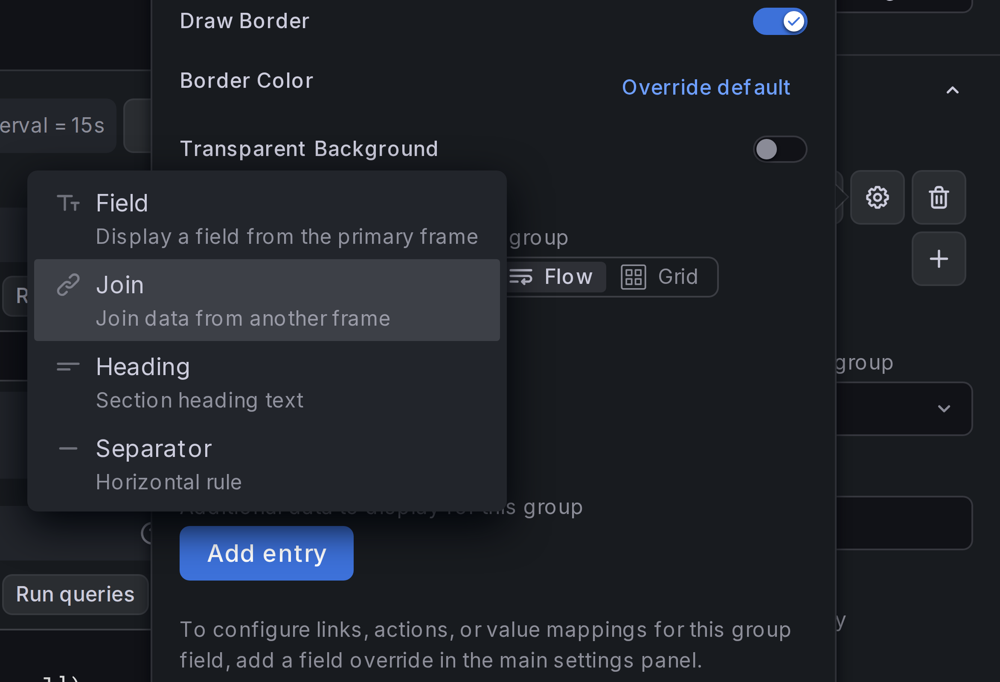
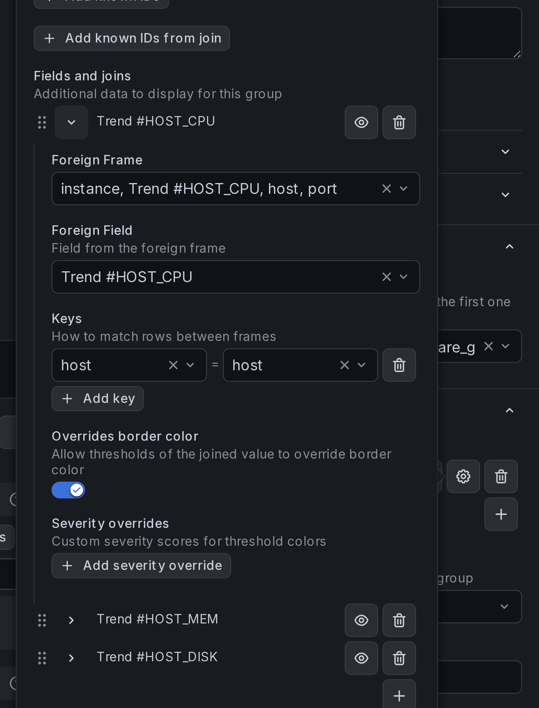
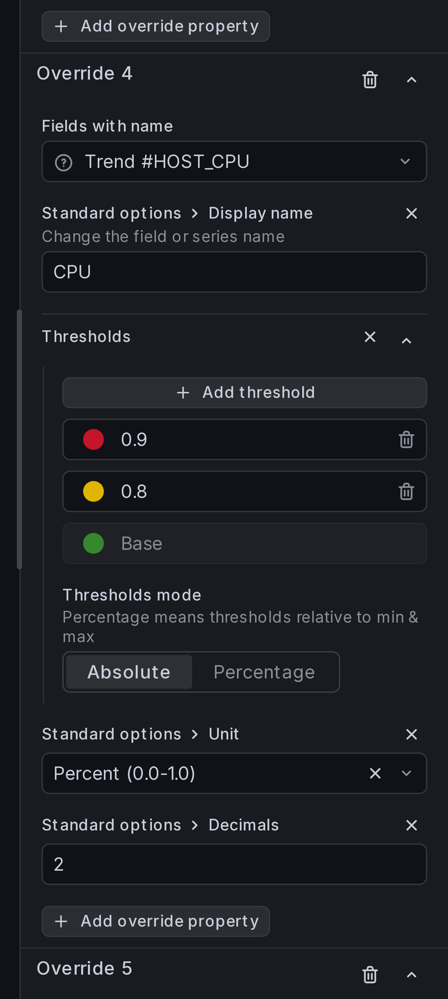
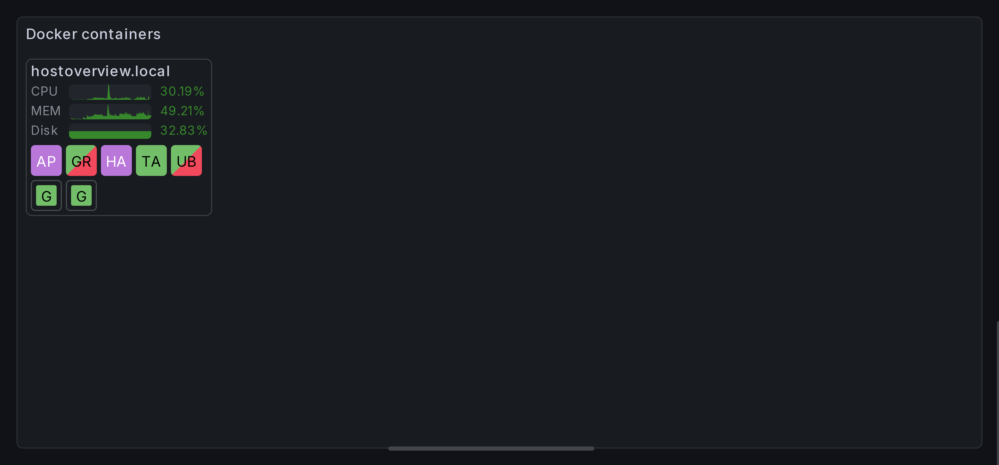

# Adding data to host groups

We can add Node Exporter data to hosts, similar to how we've joined cAdvisor
data to containers.

## Step 1: Add queries for CPU, Memory, and Disk usage

Add three new queries based on Node Exporter metrics:

```
1 - avg by (instance) (
    rate(node_cpu_seconds_total{mode="idle"}[$__rate_interval])
)
```

```
1 - (node_memory_MemAvailable_bytes / node_memory_MemTotal_bytes)
```

```
max by (instance) (
    (
        sum by (instance, device) (node_filesystem_size_bytes{device!~"rootfs"})
        -
        sum by (instance, device) (node_filesystem_avail_bytes{device!~"rootfs"})
    ) / (
        sum by (instance, device) (node_filesystem_size_bytes{device!~"rootfs"})
    )
)
```



## Step 2: Add fields to the `host` group

Navigate to **Grouping and layout** > **Resource groups**, and open settings for
group `host` (cog button). Under **Fields and joins**, add joins for newly created
requests. Join on key `host` (we can't use `instance` here because we're grouping
by `host`).

{ width="500" }

## Step 3: Enable border color overrides

In the newly created joins, enable option **Overrides border color**:

{ width="500" }

## Step 4: Add field overrides

Add field overrides, similar to how we did for
[resource status](basic-setup.md#step-8-add-field-overrides):

{ width="300" }

!!! Tip

    Darker colors look better in group-level thresholds.

## Result

You should now see host-level metrics in your panel.


