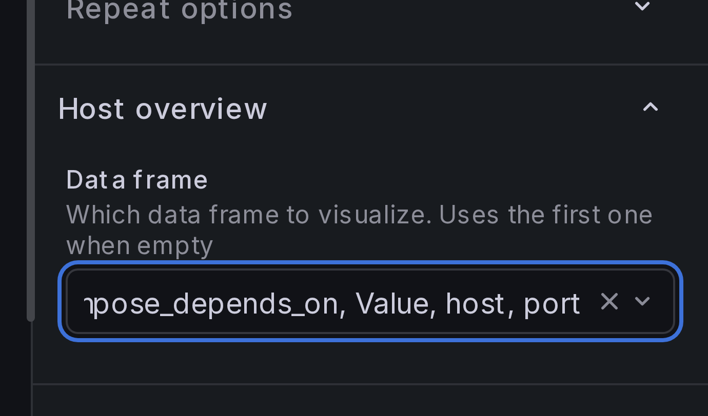
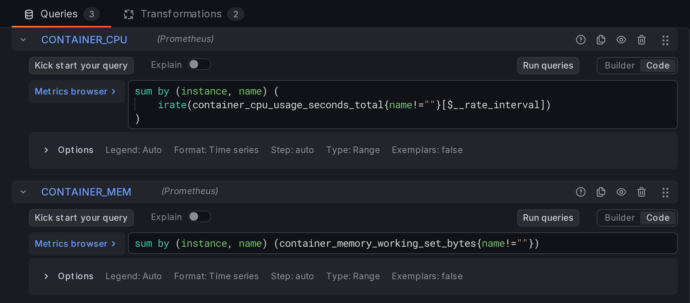
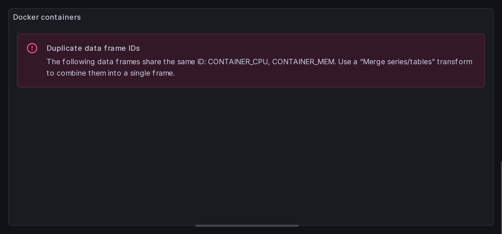
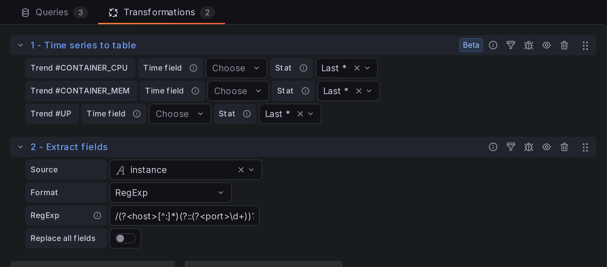
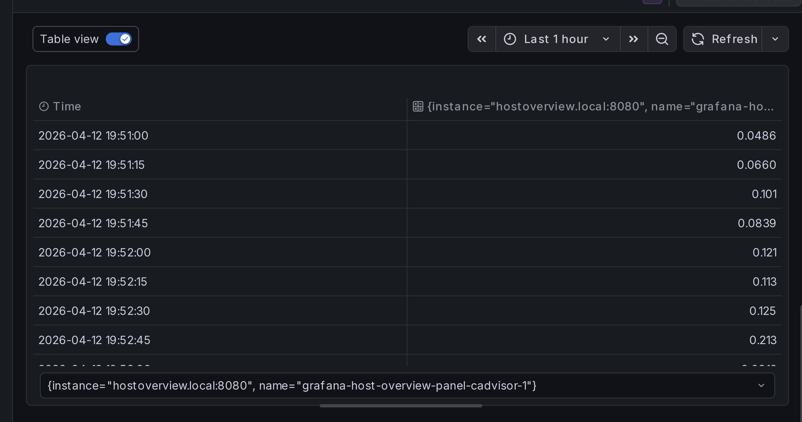
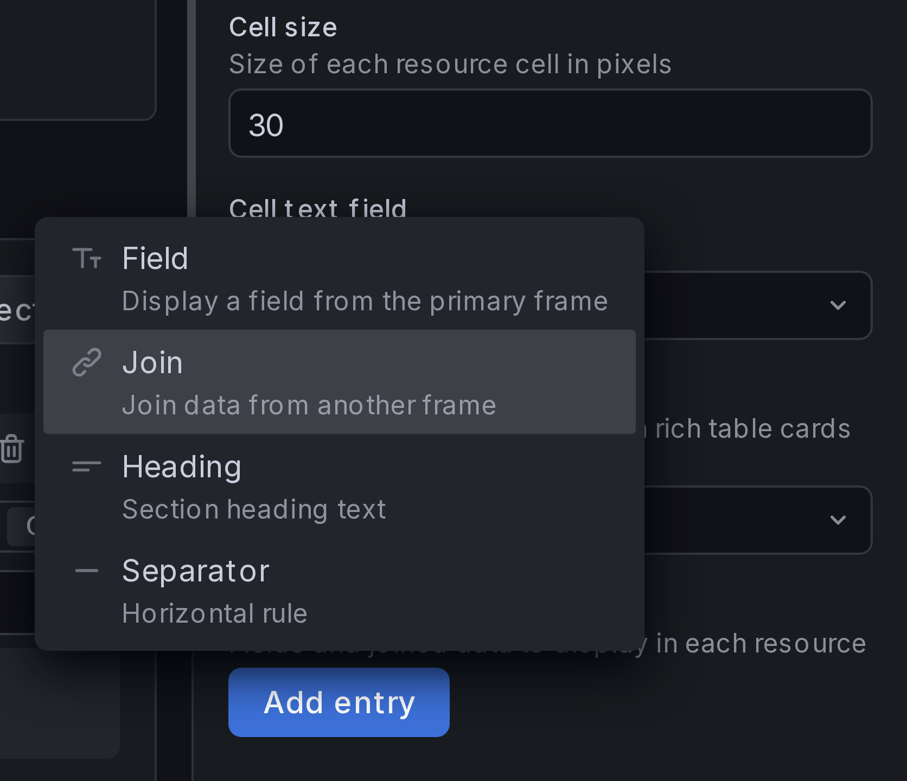
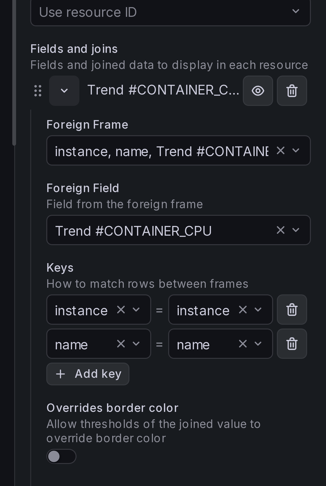
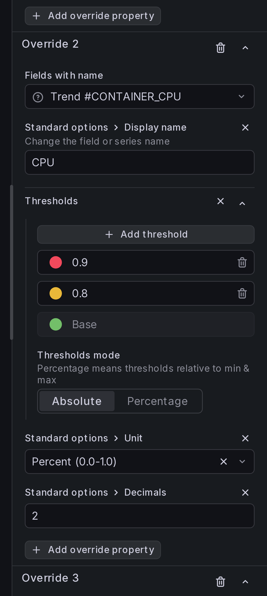
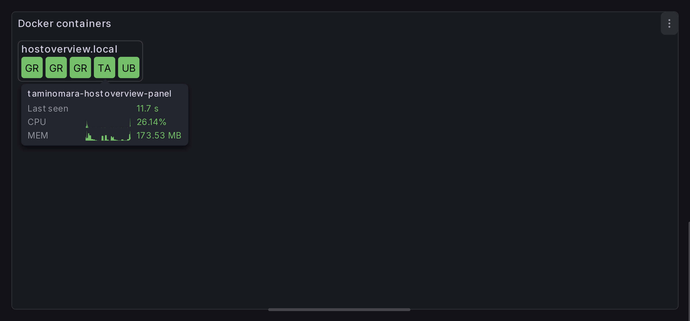

# Adding more data

In the [previous section](basic-setup.md) we've displayed all docker containers.
In this section, we'll add more info to tooltips and host groups.

## Step 1: Select primary frame

We're going to add more queries to our panel. Before we begin, we need to select
which query returns primary data which is used to display containers.

Under **Host Overview** > **Data frame**, select `UP` as the primary data frame.

{ width="300" }

## Step 2: Add queries for container metrics

Create two more queries that fetch per-container CPU and Memory usage:

```
sum by (instance, name) (
    irate(container_cpu_usage_seconds_total{name!=""}[$__rate_interval])
)
```

```
sum by (instance, name) (container_memory_working_set_bytes{name!=""})
```

Set the query type to **Range** and the format to **Time series**: we'll use
sparkline visualization for both.



!!! Note

    The panel might complain about having multiple frames with the same IDs.
    This is expected and will be addressed in the next step.

    

## Step 3: Convert time series to a table with sparklines

We have two queries returning multiple time series, each in its own data frame.
We need to join them into a single data frame.

Add a new transformation, **Time series to table**. Move it before **Extract fields**:



!!! Tip

    **Table view is your friend.**

    If you don't understand how your data is laid out, switch preview
    to the **Table view**:

    

    Each table represents a data frame: a unit of information that the panel
    can visualize. You can switch between data frames using the selector
    below the table.

## Step 4: Configure tooltip contents

Under **Resource content** > **Fields and joins**, click button **Add entry**
and add a **Join**:

{ width="300" }

Select `CONTAINER_CPU` as **Foreign Frame**, `Trend #CONTAINER_CPU` as **Foreign Field**.
Add join keys `instance` and `name`:

{ width="300" }

In a similar way, add join for container memory.

## Step 5: Add field overrides

Add field overrides, similar to how we did for
[resource status](basic-setup.md#step-8-add-field-overrides):

{ width="300" }

## Result

You should now see additional data in all container tooltips.


