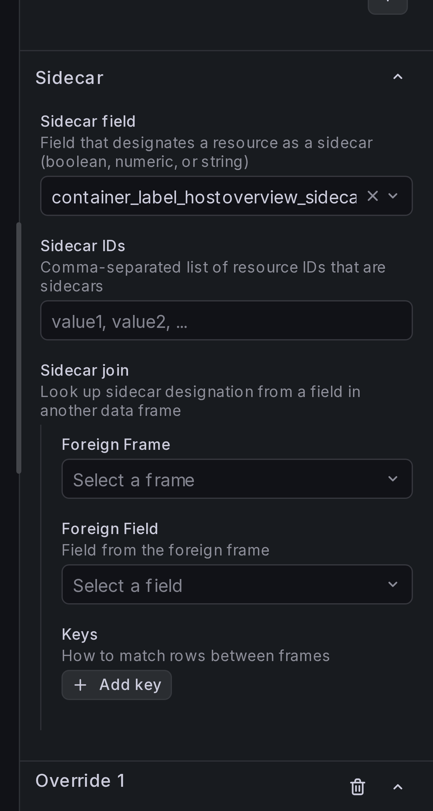
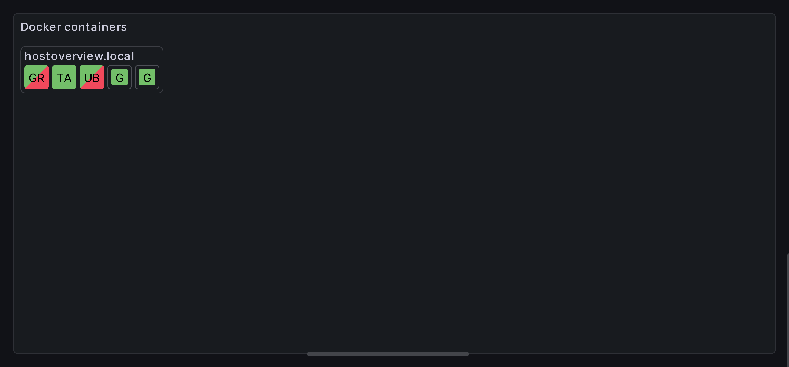

# Marking cells as sidecars

Some docker containers are less important than others. In this section,
we'll mark such containers as sidecars to give them distinct visual
appearance.

## Step 1: Decide how to mark resources as sidecars

Under **Sidecar** options, there is a number of ways to mark resource
as a side car. You can provide a static list of **Sidecar IDs**,
you can select a field with boolean value, or you can use a join to pull
this data from a separate query.

## Step 2: Add sidecar designation

In our demo setup, sidecar containers have label `hostoverview.sidecar: true`,
so we'll use **Sidecar field**.

Under **Sidecar** > **Sidecar field**, select `container_label_hostoverview_sidecar`:

{ width="300" }

## Result

You should now see sidecar containers using smaller cells. They're sorted
after all other containers.

## How sidecar field values are interpreted

When using **Sidecar field**, the panel interprets the field value depending on
its type:

- **String fields** — the values `"true"`, `"yes"`, and `"1"` (case-insensitive)
  are treated as sidecar. All other strings (including empty) are not.
- **Numeric fields** — any non-zero value is treated as sidecar.
- **Boolean fields** — `true` is sidecar, `false` is not.
- **Null or missing values** — always treated as not a sidecar.
