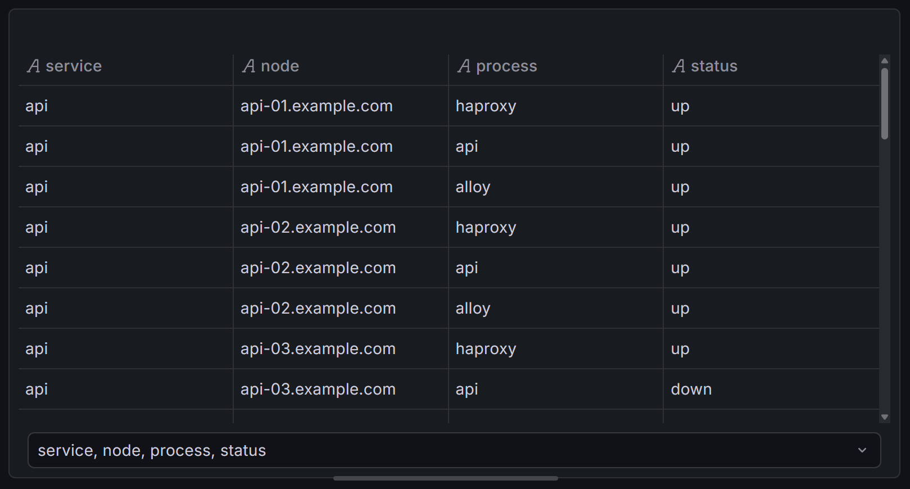
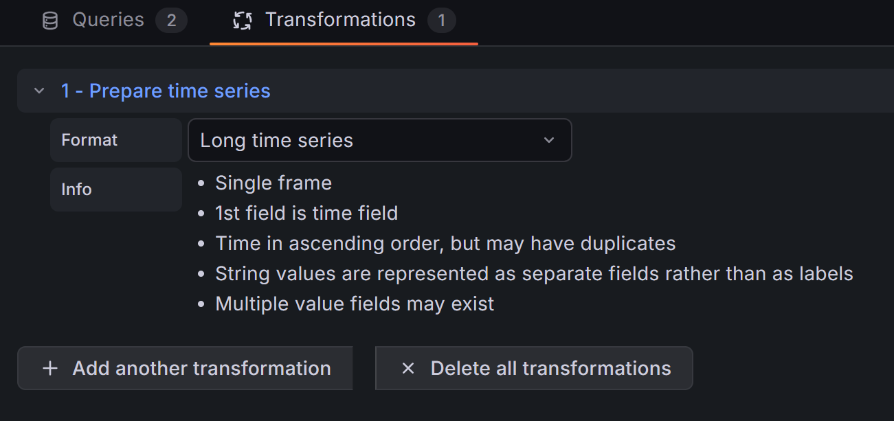

# Host Overview Panel

A Grafana panel plugin for visualizing the status of fleets of resources — servers, database instances, containers, or any entity with a status field and optional metrics.

## Features

- **Flexible grouping** — nest resources by any combination of fields, with configurable sort order, coloring, and layout.
- **Multiple display modes** — simple colored cells, cells with text labels, or rich table cards showing multiple fields per resource.
- **Joins** — attach metrics from other data frames to groups or individual resources via key-based joins.
- **Field visualizations** — text, colored text, colored background, gauges, and sparklines for joined or inline fields.
- **Color overrides** — fields and joins can override cell colors based on threshold severity.
- **Data links support** — defined data links for any group, resource, or metric.
- **Tooltips** — hoverable tooltips with configurable title, fields, and joined data.

## Requirements

- Grafana 12.0 or later.

## Data format

Host Overview Panel requires data in long format. That is, a table with
a column for resource ID and metrics.

In most use-cases, the ["Prepare time series"] transformation with
"Long time series" will do the job.

["Prepare time series"]: https://grafana.com/docs/grafana/latest/visualizations/panels-visualizations/query-transform-data/transform-data/#prepare-time-series

If you want to visualize sparklines, you may also consider
["Time series to table"].

["Time series to table"]: https://grafana.com/docs/grafana/latest/visualizations/panels-visualizations/query-transform-data/transform-data/#time-series-to-table-transform
